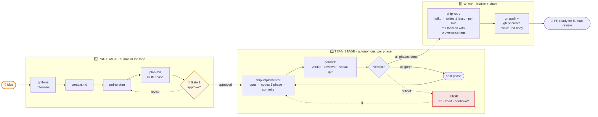
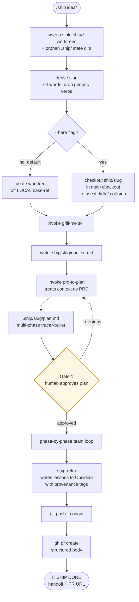
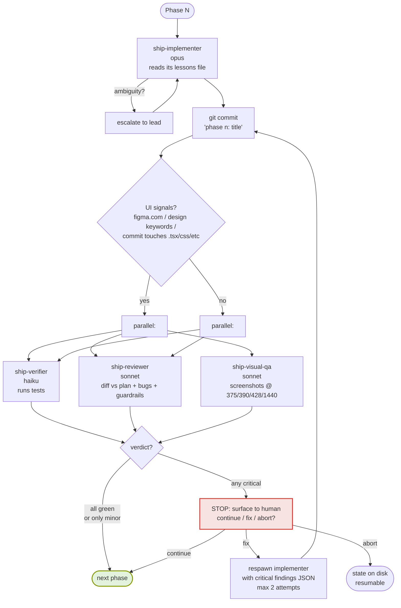

# ship — Architecture

Four views, increasing in detail:

1. **Block scheme** — at-a-glance overview (this page, below)
2. **High-level flow** — full pipeline with sweep + worktree (or `--here`) + retry
3. **Phase loop** — what happens inside one phase
4. **Agent topology + memory** — who reads / writes what, where

---

## Block scheme — at a glance



`*` visual-qa is **conditional** — fires only when the phase's commit touches UI files (`*.tsx/jsx/css/scss/module.*/vue/svelte`) OR the plan/context mentions `figma.com` / mobile / breakpoints / responsive / design system / mockup. Backend-only phases skip it.

**Key properties:**

- **One human gate** (Stage 1 → Stage 2 boundary). Everything else auto-flows on green.
- **Phase-by-phase, not big-bang.** Each phase is a tracer-bullet vertical slice that's individually verifiable.
- **Critical-finding interrupt.** If verifier / reviewer / visual-qa flags critical, the loop stops and asks. Minor findings auto-continue; surfaced in the final PR body.
- **Bidirectional memory.** Each subagent reads its `<role>-lessons.md` at startup; retro auto-writes max 1 lesson per role per run with `<!-- ship/<slug> YYYY-MM-DD -->` provenance tags so stale ones are trivial to prune.
- **End state is a PR, not a merge.** Push and open are automated; merge stays human-only.

---

## High-level flow



Single human gate. Everything else auto-continues on green; stops on critical findings.

---

## Phase loop (per phase)



The fix loop respawns `ship-implementer` with the consolidated critical findings (verifier failure JSON + reviewer + visual-qa criticals filtered to `severity == "critical"`). Max 2 retries per phase, then escalate. See SKILL.md Step 6d for the spawn-prompt template.

---

## Agent topology + memory

```mermaid
flowchart LR
    subgraph LeadCtx[/ship lead context]
        Lead[orchestrator<br/>opus 1M]
    end

    Lead --> Grill[grill-me skill]
    Lead --> P2P[prd-to-plan skill]
    Lead --> Imp[ship-implementer<br/>opus]
    Lead --> Ver[ship-verifier<br/>haiku]
    Lead --> Rev[ship-reviewer<br/>sonnet]
    Lead --> Vis[ship-visual-qa<br/>sonnet, conditional]
    Lead --> Retro[ship-retro<br/>haiku]

    subgraph Vault[Obsidian vault — Sessions/_agents/ship/]
        IL[(implementer-lessons.md)]
        VL[(verifier-lessons.md)]
        RL[(reviewer-lessons.md)]
        VQL[(visual-qa-lessons.md)]
    end

    Imp -.reads at start.-> IL
    Ver -.reads at start.-> VL
    Rev -.reads at start.-> RL
    Vis -.reads at start.-> VQL

    Retro ==auto-writes==> IL
    Retro ==auto-writes==> VL
    Retro ==auto-writes==> RL
    Retro ==auto-writes==> VQL

    classDef agent fill:#e8eef7,stroke:#268bd2,stroke-width:1px
    classDef vault fill:#fdf6e3,stroke:#b58900,stroke-width:1px
    class Imp,Ver,Rev,Vis,Retro agent
    class IL,VL,RL,VQL vault
```

Lessons memory is bidirectional: each agent reads its own file at startup; retro auto-writes (max 1 lesson per role per run, tagged for pruning). Lessons compound across runs.

---

## State files (per run)

State dir is `<worktree>/.ship/<slug>/` in worktree mode, `<repo-root>/.ship/<slug>/` in `--here` mode. Always gitignored.

| File | Written by | Meaning |
|---|---|---|
| `context.md` | lead, after grill-me | resolved decisions; PRD-equivalent |
| `plan.md` | lead, via prd-to-plan | multi-phase tracer-bullet plan |
| `approved` | lead, after Gate 1 | empty file marking human approval |
| `phase-N.commit` | lead, after implementer | empty file marking phase N committed |
| `phase-N-verifier.md` | ship-verifier | test command + counts + JSON verdict |
| `phase-N-reviewer.md` | ship-reviewer | findings table + JSON verdict |
| `phase-N-visual.md` | ship-visual-qa (if fired) | screenshots + findings + JSON verdict |
| `screenshots/phase-N/` | ship-visual-qa | only kept screenshots referenced in findings |
| `retro.done` | lead, after retro | empty file marking run complete |

Resume detection (Step 2) inspects which files exist to determine the next phase.

---

## Visual-qa signal detection

`ship-visual-qa` is conditional. It fires **only if any one** of:

- Plan or context contains `figma.com/`
- Plan or context mentions `mockup`, `screenshot`, `design system`, `mobile`, `breakpoint`, `responsive`
- Phase commit changes any file matching `*.tsx`, `*.jsx`, `*.css`, `*.scss`, `*.module.*`, `*.vue`, `*.svelte`

This avoids spawning a sonnet subagent on phases that touch only backend code.

---

## Hard rules (never violate)

- Default to a worktree. `--here` runs in the main checkout but refuses on a dirty tree, and refuses if a live worktree already holds `ship/<slug>` for the same slug.
- One Gate only (plan approval). Never auto-approve.
- Never invent phases — execute what `plan.md` says.
- Never silently skip a phase. Failure → stop and ask.
- Push and open a PR at the end — but never **merge**. Merge stays human-only.
- Visual-qa fires conditionally. Never force-run on every phase.
- Never delete `.ship/<slug>/` mid-run. Resume needs it.

---

## Why these defaults?

| Choice | Rationale |
|---|---|
| Opus for implementer | reasoning-heavy code generation |
| Haiku for verifier | I/O-bound: run tests, parse output |
| Sonnet for reviewer | diff reasoning needs more than haiku, less than opus |
| Sonnet for visual-qa | vision capability + multi-step screenshot orchestration |
| Haiku for retro | summarization; cheap |
| One Gate (plan only) | grill-me already grills; prd-to-plan structures; reviewer post-hoc — adversarial pressure baked in |
| Auto-write retro | provenance tags make pruning trivial; human gate adds friction without proportional value |
| Branch off LOCAL ref | captures unpushed housekeeping (e.g. fresh gitignore) |
| Phase-by-phase, not full run | natural cut points for verify+review; deliberate pause if anything red |

---

## What's not (yet) covered

- **Bug fixes** — /ship is overkill for one-line fixes. Use direct edit + commit.
- **Multi-package monorepos** — untested at v1. Should work but coordination across packages may need extra prompts.
- **Cross-machine resume** — `.ship/` is local-only. Resume works on the same machine; a different laptop needs to start fresh.
- **Concurrent /ship runs** — different slugs can coexist in worktree mode (each in its own worktree). `--here` mode is single-occupancy by definition (one main checkout, one HEAD). Same slug across modes → Step 2 detects mode from on-disk state and resumes; cross-mode collision (worktree + `--here` for same slug) is refused.
