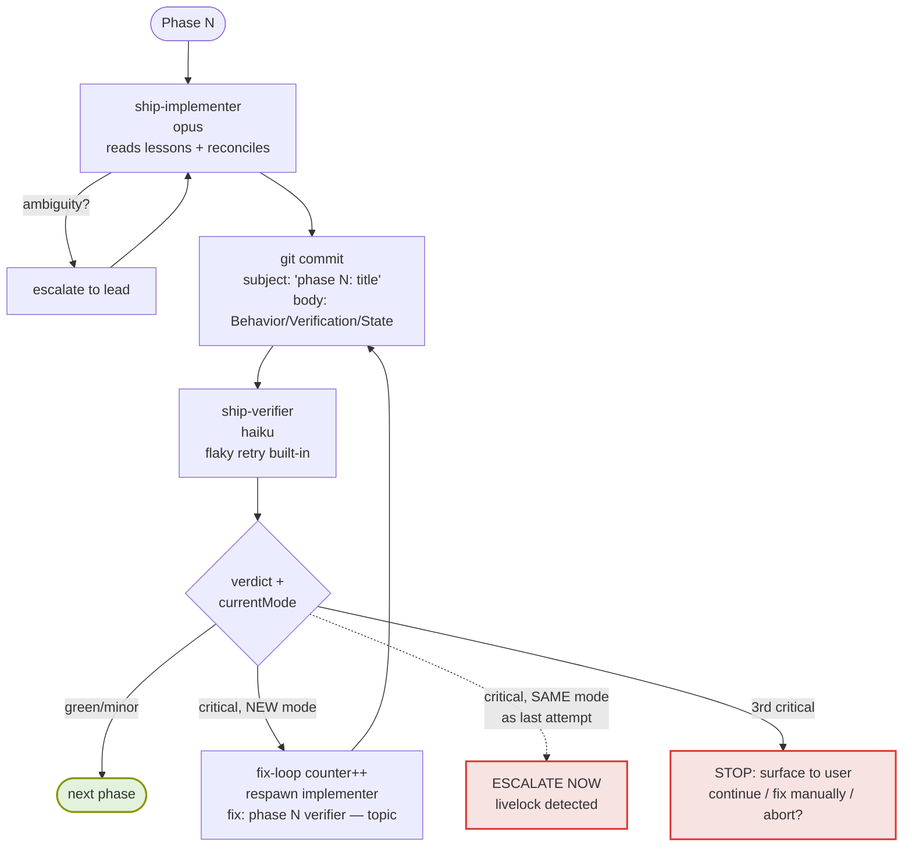
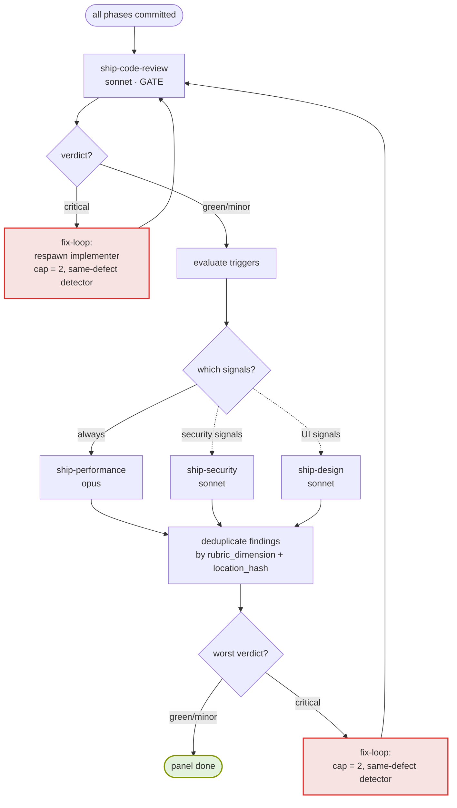

# ship — Architecture (v2)

Three views, increasing in detail:

1. **Block scheme** — at-a-glance overview
2. **Phase loop** — what happens per phase
3. **End-of-run panel** — gated multi-aspect review

---

## Block scheme — at a glance

```mermaid
flowchart LR
    Idea([💡 idea / ticket URL / freeform]):::input

    subgraph Stage1["1️⃣ INPUT + GRILL  ·  human in the loop"]
        direction TB
        S1A[input parser<br/>+ branch setup]
        S1B[grill-me skill<br/>Socratic interview]
        S1C[lead emits plan<br/>tracer-bullet, triplet/phase<br/>+ out-of-scope list]
        S1D{👤 inline<br/>'go'?}:::gate
        S1A --> S1B --> S1C --> S1D
    end

    subgraph Stage2["2️⃣ PHASE LOOP  ·  per phase, fresh agents"]
        direction TB
        S2A[ship-implementer<br/>opus  ·  fresh per phase<br/>commits with sprint contract in body]
        S2B[ship-verifier<br/>haiku  ·  rubric + same-defect mode]
        S2C{verdict?}
        S2A --> S2B --> S2C
        S2C -->|green/minor| S2D([next phase])
        S2D --> S2A
        S2C -.critical.-> S2E[fix-loop forward-only<br/>max 2 + same-defect detector]:::stop
        S2E -.fix.-> S2A
    end

    subgraph Stage3["3️⃣ END-OF-RUN PANEL  ·  sequential gate"]
        direction TB
        S3A[ship-code-review<br/>sonnet  ·  GATE  ·  always]
        S3B{green?}
        S3A --> S3B
        S3B -->|yes| S3C[parallel:<br/>security  ·  performance  ·  design]
        S3B -.critical.-> S3E[fix-loop<br/>max 2]:::stop
        S3C --> S3D{aggregate?}
        S3D -->|all green/minor| S3F([panel done])
        S3D -.critical.-> S3E
        S3E -.fix.-> S3A
    end

    subgraph Stage4["4️⃣ WRAP  ·  finalize + share"]
        direction TB
        S4A[ship-retro<br/>haiku  ·  vault writes only<br/>structured template + cap]
        S4B[git push +<br/>gh pr create<br/>detected template + 3-layer evidence body]
        S4A --> S4B
    end

    Idea --> S1A
    S1D -.revise.-> S1C
    S1D -->|approved| S2A
    S2C -->|all phases done| S3A
    S3F --> S4A
    S4B --> Out([🚢 PR ready for human review])

    classDef input fill:#fff5e6,stroke:#e87600,stroke-width:2px
    classDef gate fill:#fdf6e3,stroke:#b58900,stroke-width:2px
    classDef stop fill:#f8e3e3,stroke:#dc322f,stroke-width:2px
```



**Key properties:**

- **Inline approval** at end of grill-me. Plan shown in chat; user types `go`. No separate gate file, no `.ship/approved` marker.
- **Fresh implementer per phase.** Context resets; prior phases reachable via `git log`/`git show` (sprint contract is embedded in commit body).
- **Hybrid review.** Per-phase = tests only (mechanical). End-of-run = 1 + 3 reviewer panel.
- **Sequential gate.** code-review fires first; security/performance/design parallel only if code-review is green.
- **Two independent retry caps.** Per-phase verifier: max 2. End-of-run panel: max 2. Same-defect detector overrides both — identical failure mode = immediate escalation, no budget burn.
- **Cross-component defects auto-critical.** State propagation, resource leaks, interface mismatches — all promoted regardless of agent's stated severity.
- **Findings need evidence.** Every finding carries `evidence: {type, ref}` (test/log/trace/screenshot). Findings without it are dropped before the lead reads them.
- **Bidirectional memory.** Each subagent reads its `<role>-lessons.md` from Obsidian vault at startup; retro auto-writes structured 4-field lessons (Trigger/Symptom/Correction/Expires-when) with file cap of 100 lines and provenance tags.
- **No filesystem state.** No `.ship/` directory. Plan + decisions live in lead's context; sprint contract embedded in commit message bodies; screenshots ephemeral in `/tmp/ship-<runId>/`. Resume not supported — interrupted run = restart.
- **Worktree management out of scope.** /ship runs in whatever directory the user invoked it from. If on `<base-ref>`, auto-creates a branch using detected repo conventions. Otherwise, trusts the current branch.
- **End state is a PR.** Merge stays human-only.

---

## Phase loop (per phase)



**Sprint contract** (the triplet — Behavior / Verification command / State) is the contract between lead and implementer. It travels in:
1. The implementer's spawn prompt.
2. The commit message body, recoverable forever via `git show <sha>`.

The verifier receives only the `Verification` command. No file paths. Independent of state-on-disk.

---

## End-of-run panel (sequential gate)



### Trigger evaluation

**Security trigger** (sonnet, conditional). Fires if EITHER:
- Diff `<base-ref>..HEAD` touches files matching: `*auth*`, `*login*`, `*session*`, `*crypto*`, `*token*`, `*permission*`, raw SQL, `package.json`, `*.env*`, files introducing `dangerouslySetInnerHTML` or `eval(`.
- Plan or out-of-scope mentions: `auth`, `login`, `password`, `token`, `secret`, `oauth`, `permission`, `admin`, `payment`, `pii`, `gdpr`, `encryption`.

**Design trigger** (sonnet, conditional). Fires if EITHER:
- Diff touches: `*.tsx`, `*.jsx`, `*.css`, `*.scss`, `*.module.*`, `*.vue`, `*.svelte`.
- Plan mentions: `figma.com/`, `mockup`, `screenshot`, `design system`, `mobile`, `breakpoint`, `responsive`.

**Performance** (opus, always).

### Why sequential?

Code-review fires first as a cheap-signal gate. If the basic correctness layer is broken, spending opus tokens on performance analysis or sonnet tokens on security/design is waste. Once code-review is green, the parallel trio runs concurrently.

### Deduplication

When two panel agents flag the same `(rubric_dimension, location_hash)`, the lead keeps the higher-severity one with merged evidence. Reduces redundant fix-loop entries.

---

## Agent topology + memory

```mermaid
flowchart LR
    subgraph LeadCtx[/ship lead context]
        Lead[orchestrator<br/>plan in memory<br/>sprint contracts via git]
    end

    Lead --> Grill[grill-me skill]
    Lead --> Imp[ship-implementer<br/>opus]
    Lead --> Ver[ship-verifier<br/>haiku]
    Lead --> CR[ship-code-review<br/>sonnet  ·  gate]
    Lead --> Sec[ship-security<br/>sonnet  ·  cond]
    Lead --> Perf[ship-performance<br/>opus]
    Lead --> Des[ship-design<br/>sonnet  ·  cond]
    Lead --> Retro[ship-retro<br/>haiku]

    subgraph Vault[Obsidian vault — Sessions/_agents/ship/]
        IL[(implementer-lessons.md)]
        VL[(verifier-lessons.md)]
        CRL[(code-review-lessons.md)]
        SL[(security-lessons.md)]
        PL[(performance-lessons.md)]
        DL[(design-lessons.md)]
    end

    Imp -.reads at start.-> IL
    Ver -.reads at start.-> VL
    CR -.reads at start.-> CRL
    Sec -.reads at start.-> SL
    Perf -.reads at start.-> PL
    Des -.reads at start.-> DL

    Retro ==auto-writes==> IL
    Retro ==auto-writes==> VL
    Retro ==auto-writes==> CRL
    Retro ==auto-writes==> SL
    Retro ==auto-writes==> PL
    Retro ==auto-writes==> DL

    classDef agent fill:#e8eef7,stroke:#268bd2,stroke-width:1px
    classDef vault fill:#fdf6e3,stroke:#b58900,stroke-width:1px
    class Imp,Ver,CR,Sec,Perf,Des,Retro agent
    class IL,VL,CRL,SL,PL,DL vault
```

Each subagent reads its own lessons file at startup. **Reconciliation rule:** lessons are priors, current task is evidence; on conflict, follow task and emit `lessonConflicts` so retro can flag the lesson for expiry.

Retro writes structured 4-field lessons with auto-prune at 100-line cap. Lessons live in the user's personal vault — never in the repo.

---

## Output return shape (all reviewer agents)

```json
{
  "agent": "<role>",
  "rubric": { "dimension1": "A-D", "dimension2": "A-D", ... },
  "findings": [
    {
      "severity": "critical | minor",
      "dimension": "<rubric key>",
      "location": "<file:line or route>",
      "summary": "<one-line>",
      "fix_hint": "<concrete suggestion>",
      "evidence": { "type": "test|log|trace|screenshot", "ref": "<verbatim or path>" }
    }
  ],
  "verdict": "green | minor | critical",
  "previousMode": "<from spawn, or null>",
  "currentMode": "<short stable id of THIS critical pattern>",
  "lessonConflicts": [{ "lesson": "...", "reason": "..." }]
}
```

`currentMode` enables the same-defect detector. `lessonConflicts` enables retro expiry.

---

## What `/ship` does NOT do

- **Manage worktrees.** No sweep, no create, no `--here` flag, no mode detection. User pre-creates if they want isolation.
- **Persist state to disk.** No `.ship/` directory. Resume across sessions not supported.
- **Auto-merge PRs.** Always stops at PR. Merge requires explicit follow-up user request.
- **Write to repo files via retro.** No CLAUDE.md edits. Lessons are personal cross-repo, vault only.
- **Auto-start dev servers.** Design agent reports critical if no dev server detected.
- **Push to `<base-ref>`.** Refuses if user is on main with a dirty tree; auto-branches if main is clean.
- **Override the PR base branch.** Always uses repo default. Rebase target manually if needed.

---

## Hard rules (never violate)

- One Gate only — inline `go` at end of grill-me. Never auto-approve.
- One commit per phase, subject `phase <N>: <title>`, body embeds the sprint triplet.
- Fix-loop commits are forward-only (`fix: <topic>`). Never amend, never rebase.
- Per-phase verifier and end-of-run panel each have **independent** retry caps of 2.
- Same-defect detector (`previousMode == currentMode`) overrides retry counters.
- Cross-component / boundary defects auto-promote to critical.
- Findings without `evidence` are dropped.
- Lessons file cap = 100 lines. Retro prunes before write or skips.
- Push and open a PR at the end. Never merge.
