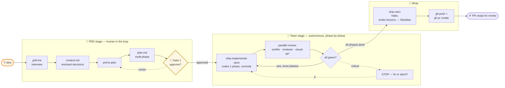

# ship

End-to-end feature workflow for [Claude Code](https://docs.anthropic.com/claude/claude-code) — `/ship <idea>` takes a feature from raw idea to a ready-to-review PR via a 5-agent team.

## How it works



`*` visual-qa fires only when commits touch UI files or plan mentions `figma.com` / mobile / breakpoints / design system.

**One human gate** (plan approval). After that the team runs autonomously, phase by phase, with a critical-finding interrupt. Lessons accumulate in Obsidian per role with provenance tags so stale ones are easy to prune.

## Install

Requires:
- [Claude Code](https://docs.anthropic.com/claude/claude-code) CLI
- [`gh`](https://cli.github.com/) (for the auto-PR step)
- A git repo to ship into
- (Optional) [grill-me](https://github.com/anthropics/skills) and [prd-to-plan](https://github.com/anthropics/skills) skills installed
- (Optional) Obsidian vault for retro lessons

```bash
git clone https://github.com/<YOUR-USER>/ship.git ~/Documents/hobby/ship
cd ~/Documents/hobby/ship
./install.sh
```

`install.sh` symlinks the skill + agents into your `~/.claude/` and `~/.agents/` paths. Edit either side; both stay live.

After install, restart Claude Code so it picks up the new skill + agents.

## Usage

From inside any git repo:

```
/ship <feature idea>
```

Example: `/ship implement light/system/dark modes`.

The skill takes you through grill-me, writes a plan, asks for approval, runs the agent team phase-by-phase, and ends with a live PR URL.

## Structure

```
ship/
├── skills/ship/SKILL.md        # the orchestrator skill — 200+ lines
├── agents/                     # 5 specialist subagents
│   ├── ship-implementer.md     # opus — codes one phase per spawn
│   ├── ship-verifier.md        # haiku — runs tests
│   ├── ship-reviewer.md        # sonnet — diff vs plan + guardrails
│   ├── ship-visual-qa.md       # sonnet — conditional spawn on UI signals
│   └── ship-retro.md           # haiku — writes lessons to Obsidian
├── docs/
│   └── architecture.md         # detailed flow + mermaid diagrams
├── install.sh                  # symlink setup
├── README.md
├── CHANGELOG.md
└── .gitignore
```

## Why this exists

Replaces a manual chain (`grill-me` → `write-a-prd` → `prd-to-plan` → `/ticket` or `/orchestrate`) where each skill required an explicit invocation. `/ship` collapses it into a single command with one human gate (plan approval). See [`docs/architecture.md`](docs/architecture.md) for diagrams + design rationale.

Built and tested on a Next.js + Payload CMS site (belcreation). First validation run shipped a tri-state (light/system/dark) theme toggle — see PR #38 on `aliaksei-loi/camp` for the actual output.

## Customizing

The agents and skill are plain Markdown files. Edit them in this repo (the symlinks make changes live). Common tweaks:

- **Add stack-specific guardrails** to `agents/ship-reviewer.md` (e.g. "block any commit touching `payload.config.ts` without a sibling migration in `src/migrations/`").
- **Adjust visual-qa signals** in `skills/ship/SKILL.md` Step 6c — add Figma URLs, mockup paths, etc.
- **Tune model tiers** by editing `model:` in agent frontmatter (opus/sonnet/haiku).

## License

MIT.
