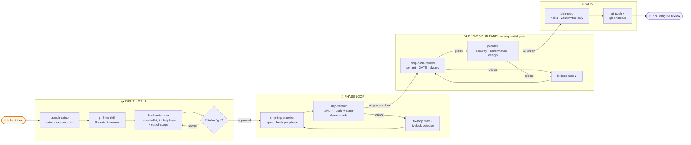

# ship

End-to-end feature workflow for [Claude Code](https://docs.anthropic.com/claude/claude-code) — `/ship <prompt>` takes a feature idea (ticket URL, issue link, or freeform) from raw input to a ready-to-review PR via a 7-agent team with a sequential review panel.

## How it works



**One human gate** — inline `go` at the end of grill-me. After that the team runs autonomously. The end-of-run panel uses a **sequential gate**: code-review fires first; security/performance/design only run if code-review is green (saves opus on broken code).

**Each agent reads its own `<role>-lessons.md` from Obsidian on startup**, applies the rules, and reports any `lessonConflicts` for retro to flag for expiry. Retro auto-writes structured 4-field lessons (Trigger / Symptom / Correction / Expires-when) with a 100-line cap per file.

**No filesystem state.** No `.ship/` directory. Sprint contracts (the per-phase Behavior / Verification / State triplet) live in commit message bodies, recoverable via `git show`. Screenshots are ephemeral in `/tmp/ship-<runId>/`.

## What changed in v2 (vs v1)

- **Worktree management out of scope.** No sweep, no `--here` flag, no auto-worktree-create. /ship runs in whatever directory you invoke it from. If on the default branch with a clean tree, auto-creates a branch using detected repo conventions (`feat/`, `fix/`, etc.).
- **Single inline approval** instead of a separate plan-approval gate. grill-me ends with the plan in chat; you reply `go`.
- **Hybrid review.** Per-phase = tests only. End-of-run panel = sequential code-review gate, then security + performance + design in parallel.
- **Structured rubrics + evidence-required findings.** Every reviewer agent returns A-D scores per dimension; findings without runtime/test/log/screenshot evidence are dropped.
- **Same-defect detector** alongside retry caps. Identical failure mode twice → immediate escalation, no budget burn.
- **Cross-component defects auto-critical.** State propagation, resource leaks, interface mismatches promoted regardless of stated severity.
- **Sprint contracts** (Behavior/Verification/State triplet per phase) embedded in commit message bodies. Recoverable forever via `git show`.
- **No `.ship/` filesystem state.** Lead context + git is the source of truth. Resume across sessions not supported.
- **Retro to vault only.** No CLAUDE.md writes; lessons are personal/cross-repo.

See [`ARCHITECTURE.md`](ARCHITECTURE.md) for full diagrams.

## Install

Requires:
- [Claude Code](https://docs.anthropic.com/claude/claude-code) CLI
- [`gh`](https://cli.github.com/) (auto-PR; manual fallback if missing)
- A git repo to ship into
- (Optional) [grill-me](https://github.com/anthropics/skills) skill installed
- (Optional) Obsidian vault for retro lessons (path is hardcoded in agent files; edit if your vault lives elsewhere)

```bash
git clone https://github.com/<YOUR-USER>/ship.git ~/Documents/hobby/ship
cd ~/Documents/hobby/ship
./install.sh
```

`install.sh` symlinks the skill + 7 agents into your `~/.claude/` and `~/.agents/` paths, and removes any v1 stale symlinks (`ship-reviewer`, `ship-visual-qa`). Edit either side; both stay live.

After install, restart Claude Code so it picks up the new skill + agents.

## Usage

From inside any git repo:

```
/ship <prompt>            # ticket URL, issue URL, or freeform
/ship                     # interactive — asks "what are we shipping?"
```

Examples:
- `/ship implement light/system/dark modes`
- `/ship https://github.com/myorg/myrepo/issues/42`
- `/ship` then describe the task in chat

The skill takes you through grill-me, posts the plan inline, runs the team phase-by-phase, fires the end-of-run panel, and ends with a live PR URL.

To merge: ask explicitly afterward (`merge the ship PR`). /ship never auto-merges.

## Structure

```
ship/
├── skills/ship/SKILL.md         # the orchestrator skill
├── agents/                      # 7 specialist subagents
│   ├── ship-implementer.md      # opus — codes one phase, embeds sprint contract
│   ├── ship-verifier.md         # haiku — runs tests, rubric + same-defect mode
│   ├── ship-code-review.md      # sonnet — end-of-run GATE; bugs + quality merged
│   ├── ship-security.md         # sonnet — conditional, OWASP focus
│   ├── ship-performance.md      # opus  — always-on perf review
│   ├── ship-design.md           # sonnet — conditional, screenshots + Figma
│   └── ship-retro.md            # haiku — structured 4-field lessons → vault
├── ARCHITECTURE.md              # detailed flow + mermaid diagrams
├── install.sh                   # symlink setup
├── README.md
└── CHANGELOG.md
```

## Customizing

The agents and skill are plain Markdown. Edit them in this repo (the symlinks make changes live). Common tweaks:

- **Add stack-specific guardrails** to `agents/ship-code-review.md` (e.g. block any commit touching `payload.config.ts` without sibling migration).
- **Adjust security/design triggers** in `skills/ship/SKILL.md` Step 4b.
- **Tune model tiers** by editing `model:` in agent frontmatter (opus/sonnet/haiku).
- **Move lessons location** by editing the vault path in each agent's "Lessons memory" section + `ship-retro.md`.

## License

MIT.
